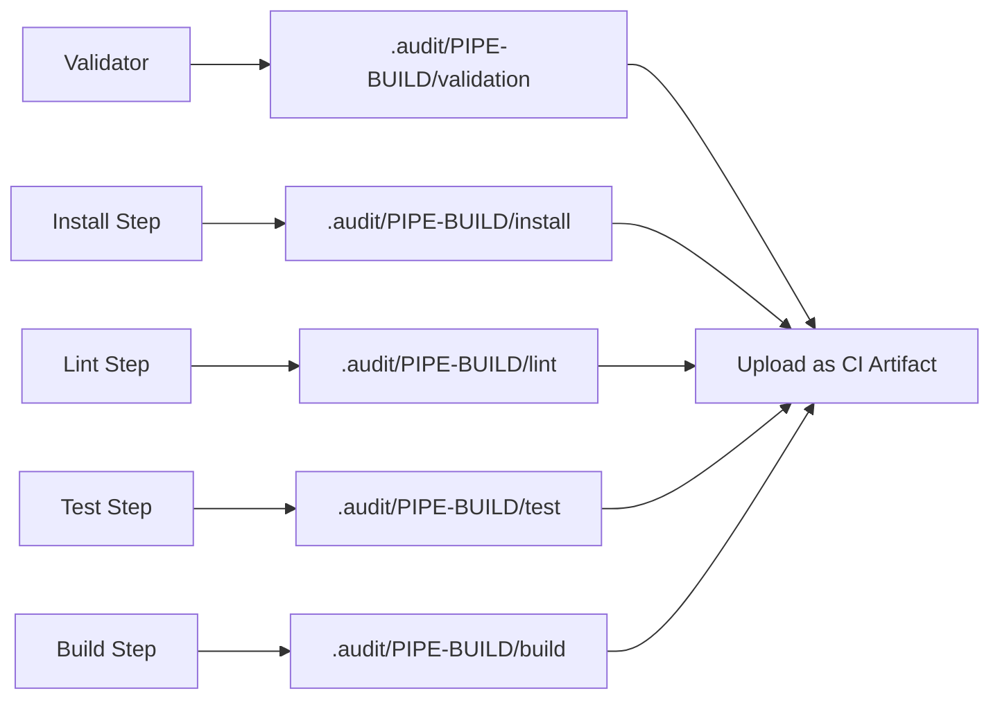

```mermaid
flowchart LR
  A[Validator] --> B[.audit/PIPE-BUILD/validation]
  C[Install Step] --> D[.audit/PIPE-BUILD/install]
  E[Lint Step] --> F[.audit/PIPE-BUILD/lint]
  G[Test Step] --> H[.audit/PIPE-BUILD/test]
  I[Build Step] --> J[.audit/PIPE-BUILD/build]
  B --> K[Upload as CI Artifact]
  D --> K
  F --> K
  H --> K
  J --> K
```