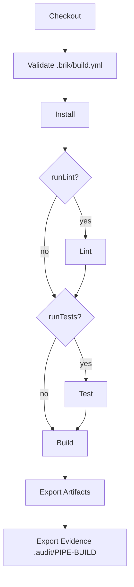

```mermaid
flowchart TD
  A[Checkout] --> B[Validate .brik/build.yml]
  B --> C[Install]
  C --> D{runLint?}
  D -- yes --> E[Lint]
  D -- no --> F{runTests?}
  E --> F
  F -- yes --> G[Test]
  F -- no --> H[Build]
  G --> H[Build]
  H --> I[Export Artifacts]
  I --> J[Export Evidence .audit/PIPE-BUILD]
```