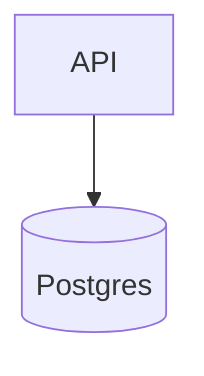
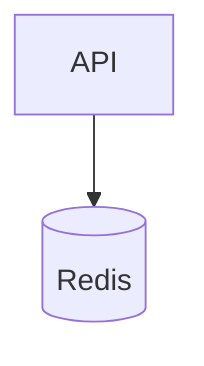
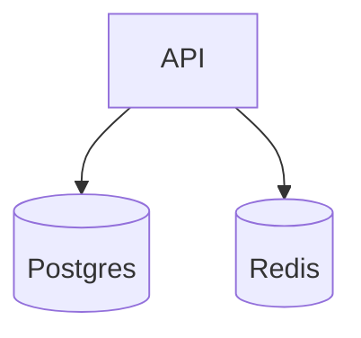

# BrikByteOS Integration Testing Guide
### Canonical Standard — v1.0

## 1. Purpose

This document defines the **single source of truth** for how integration testing is designed, executed, secured, and audited across all BrikByteOS repositories.

Integration tests in BrikByteOS validate:

- real infrastructure
- real databases
- real secrets
- real container networks
- deterministic fixtures
- governance-grade audit evidence

---
## 2. What is an Integration Test?
| Layer | Purpose | Uses Containers | Exports .audit |
| --- | --- | --- | --- |
| Unit | Logic correctness | ❌ | ❌ |
| **Integration** |	**Infrastructure + Services + Secrets** |	✅ | ✅ |
| E2E |	Browser & full user flows | Optional | Optional |

Integration tests prove your **deployment contract**, not just your code.

---
## 3. Canonical Stack Topologies

### API + Postgres


### API + Redis


### API + Postgres + Redis


---
## 4. docker-compose.integration.yml Pattern
```yaml
services:
  api:
    image: my-api:ci
    ports: ["8080:8080"]
    environment:
      DB_HOST: localhost
      DB_PORT: "5432"
      DB_NAME: ${TEST_DB_NAME}
      DB_USER: ${TEST_DB_USER}
      DB_PASSWORD: ${TEST_DB_PASSWORD}
    depends_on:
      db:
        condition: service_healthy

  db:
    image: postgres:16
    environment:
      POSTGRES_DB: ${TEST_DB_NAME}
      POSTGRES_USER: ${TEST_DB_USER}
      POSTGRES_PASSWORD: ${TEST_DB_PASSWORD}
    volumes:
      - ./integration/seed:/docker-entrypoint-initdb.d
```

---
## 5. Fixtures & Seeding

### Deterministic Seed Rule

Seeds must be:
- idempotent
- deterministic
- re-runnable
- environment safe

`integration/seed/001-payments.sql`
```sql
CREATE TABLE IF NOT EXISTS payments (...);
INSERT INTO payments (amount,currency) VALUES (100,'ZAR');
```

---
## 6. External Mock Services
```yaml
mock-payments:
  image: wiremock/wiremock
  volumes:
    - ./integration/mocks:/home/wiremock
```

`integration/mocks/payments.json`
```json
{
  "request": {"method":"POST","url":"/external/payment"},
  "response": {"status":200,"jsonBody":{"status":"approved","transactionId":"mock-123"}}
}
```

---
## 7. Env & Secret Contract
| Variable | Description |
| --- | --- |
| TEST_DB_NAME | Canonical DB name |
| TEST_DB_USER | DB user |
| TEST_DB_PASSWORD | DB password |
| DB_HOST | Runtime DB host |
| APP_BASE_URL | API URL |
| EXTERNAL_API_BASE_URL | External mock |

**Never logged / exported**
- passwords
- private keys
- tokens

---
## 8. Integration Test Patterns
### Go
```go
func TestDBFixturesArePresent(t *testing.T) {
  db := openDB()
  var c int
  db.QueryRow("SELECT COUNT(*) FROM payments").Scan(&c)
  require.True(t, c > 0)
}
```

### .NET
```csharp
[Trait("Category","Integration")]
public async Task PaymentsTable_ShouldContainSeededRows()
```

---
## 9. .audit Evidence Layout
```pgsql
.audit/
 └── YYYY-MM-DD/
     └── integration/
         ├── test-results.json
         ├── coverage-summary.json
         └── raw/junit.xml
```
| File | Purpose |
| --- | --- |
| test-results.json | Normalized pass/fail |
| coverage-summary.json | Coverage |
| raw/junit.xml | Raw runner output |

---
## 10. Troubleshooting Matrix
| Symptom | Root Cause | Fix |
| --- | --- | --- |
| DB refused | Wrong DB_HOST | Export DB_HOST=localhost |
| Empty fixtures | Seed not mounted | Check volumes |
| JUnit missing | Runner mis-wired | Write to out/junit-integration.xml |
| Mock skipped | EXTERNAL_API_BASE_URL missing | Wire mock container |

---
## 11. Reference Examples
| Stack | Repo |
| --- | --- |
| Node |	node-api-example |
| Python | python-api-example |
| Java | java-api-example |
| .NET | dotnet-api-example |
| Go | go-api-example |

---
## 12. Governance Traceability
- REQ-PIPE-CORE-2.2
- ADR-TEST-010
- ADR-AUDIT-002
- RTM-TEST-INTEG-001